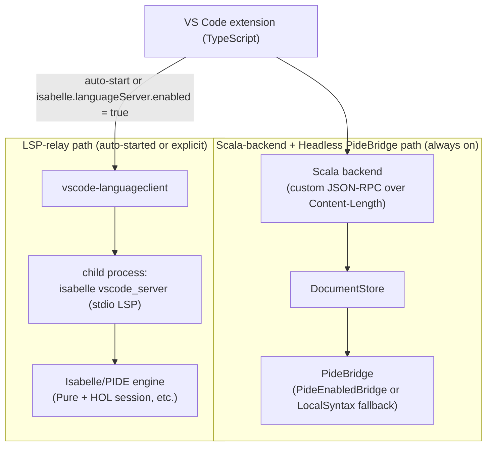

# PIDE integration notes

This document records the shipped PIDE integration architecture for milestones
4 (PIDE document connection), 5 (semantic markup with entity metadata), 6
(proof state), and 7 (Sledgehammer) of the
[repository roadmap](../README.md#roadmap). It is now implementation notes plus
remaining gaps, not a speculative rollout plan.

The extension has two additive PIDE paths:

- **Scala Headless `PideBridge` path** — the always-on backend path still owns
  the custom JSON-RPC protocol, session discovery, ROOT/ROOTS parsing, CLI
  builds, document synchronization, and local fallbacks. When Isabelle can be
  resolved at runtime, the backend also bootstraps Isabelle's Headless API via
  the real `PideBridge` implementation and powers `document/checkWithPide`,
  `proofState/getWithPide`, backend Sledgehammer search, and Sledgehammer
  proof minimization.
- **Isabelle LSP relay path** — the extension can run Isabelle's own bundled
  `isabelle vscode_server` as a child LSP process through
  `vscode-languageclient`. This path provides live editor-facing PIDE features:
  diagnostics, hover, definition, completion, `PIDE/decoration`, proof state,
  dynamic output, Sledgehammer search / insert, theory preview, abbreviation
  completion, documentation browsing, and spell-checker dictionary commands.

The local syntax-only providers remain deliberately in place as fallbacks and
coexist with both PIDE paths.

## Architecture

The architecture keeps the Scala backend as the repository-specific semantic
boundary and adds Isabelle's bundled language server as a second, editor-facing
path. Both paths ship on `main`:



> Both paths now ship on `main`. The Scala-backend path is always active. The
> LSP-relay path auto-starts when Java + Isabelle are reachable and the user
> has not explicitly opted out, or starts explicitly when
> `isabelle.languageServer.enabled = true`. VS Code aggregates results from the
> LSP-provided features and the existing local providers.

The Scala backend remains the home of session discovery, ROOT/ROOTS parsing,
the Isabelle CLI build runner, the document-synchronization protocol,
command-span extraction, document-status summaries, Headless document checks,
per-cursor proof-state extraction, backend Sledgehammer search, Sledgehammer
minimization, and any future bridge-driven semantics. The `PideBridge` seam
introduced in PR #13
([`backend/src/main/scala/dev/isabelle/vscode/server/PideBridge.scala`](../backend/src/main/scala/dev/isabelle/vscode/server/PideBridge.scala))
is preserved as the integration point for Scala-side PIDE work that does not
naturally fit into LSP requests or notifications.

The LSP relay is additive. When it starts, the extension spawns
`isabelle vscode_server` as a child process and routes LSP-standard features
(diagnostics, hover, definition, completion) through VS Code's standard
surfaces using
[`vscode-languageclient`](https://www.npmjs.com/package/vscode-languageclient).
Because LSP is the transport, those features land on the same VS Code UI
that any other language server uses (the Problems panel, the hover popover,
F12 navigation, the completion list). Isabelle-specific `PIDE/*`
notifications layer the non-standard surfaces on top: decorations, proof state,
dynamic output, Sledgehammer, preview, documentation, abbreviations, and
spell-checker dictionary commands. `textDocument/documentSymbol` remains on
the local provider because Isabelle 2025-2 does not advertise
`documentSymbolProvider`.

Why this approach:

- **Cross-platform by default.** `isabelle vscode_server` is part of the
  official Isabelle distribution, so it works anywhere the `isabelle`
  command runs — Linux, macOS, and Windows. The Windows `.ps1` launcher is
  auto-wrapped via `powershell.exe -File` so users don't need any extra
  configuration (PR #27).
- **Leverages official Isabelle infrastructure.** The PIDE wiring inside
  `isabelle vscode_server` is maintained by the Isabelle developers
  themselves and tracks the real PIDE engine. Reusing it avoids
  reimplementing PIDE inside the Scala backend.
- **Additive, not destructive.** The existing local foundations (theory
  outline, command-span decorations, conservative document-status surface,
  checked repair previews) keep working unchanged for users who disable the
  LSP relay or cannot run it, and continue to work alongside it for users who
  do.
- **No protocol churn.** The custom Content-Length JSON-RPC protocol between
  the extension and the Scala backend does not change; the new path is a
  separate LSP connection.

## Runtime prerequisites

The LSP relay requires the following runtime environment when it auto-starts
or when `isabelle.languageServer.enabled = true`. These requirements describe
what users need installed on their machine to actually exercise it.

- A working Isabelle installation reachable through the existing
  `isabelle.executablePath` setting (default: `isabelle` on `PATH`). The
  `isabelle vscode_server` tool must be present in that installation. It
  has shipped as part of the official Isabelle distribution for several
  recent major releases. The current LSP client has been
  verified end-to-end against **Isabelle 2025-2**, where the server
  advertises `codeActionProvider`, `completionProvider`,
  `definitionProvider`, `documentHighlightProvider`, `hoverProvider`, and
  `textDocumentSync` capabilities.
- No additional Linux- or macOS-only restriction. Isabelle's official
  Windows distribution ships its launcher as `isabelle.ps1`; the LSP
  client auto-wraps `.ps1`/`.psm1` paths via
  `powershell.exe -NoLogo -NoProfile -ExecutionPolicy Bypass -File <path>`
  (added in PR #27), so Windows users can enable the LSP path with the
  default `isabelle.executablePath` without any extra configuration.
- Java is already required by Isabelle itself; the extension does not add a
  separate Java dependency from the LSP-client side.
- The extension's own runtime requirement (Node.js for the extension host,
  VS Code `^1.90.0` as declared in
  [`package.json`](../package.json#L26-L28)) is unchanged.

## Configuration surface

The settings, commands, and UI surface below are **shipped on `main`**. A fresh
install with Java + Isabelle reachable normally starts the language server
automatically; users can still force it on or off explicitly.

Shipped settings (under the existing `Isabelle PIDE` configuration block):

- `isabelle.languageServer.enabled` — explicit override, package default
  `false`. Leave the setting untouched to let `isabelle.languageServer.autoStart`
  decide from the prerequisite probe. Set it to `true` to force-start, or to
  `false` at user/workspace/folder scope to force the LSP off.
- `isabelle.languageServer.autoStart` — boolean, default `true`. When
  `enabled` has not been explicitly set, automatically starts the Isabelle
  language server after the activation-time prerequisite probe finds Java 21+
  and Isabelle 2019+. A failed auto-start is remembered per resolved Isabelle
  runtime so the extension does not retry the same broken configuration on
  every activation.
- `isabelle.languageServer.extraArgs` — array of strings, default `[]`.
  Extra command-line arguments appended to the `isabelle vscode_server`
  invocation, for users who need to pass Isabelle-specific flags (for
  example session selection or logging options) that the extension does not
  surface directly.
- `isabelle.languageServer.logVerbose` — boolean, default `false`. When
  true, the extension logs LSP traffic to a dedicated trace output channel for
  diagnosing connection issues.

Shipped commands (registered alongside the existing `Isabelle:` command
family):

- `Isabelle: Start Language Server` — starts the `isabelle vscode_server`
  child process and connects the LSP client.
- `Isabelle: Retry Language Server Auto-Start` — clears the remembered
  auto-start failure for the current resolved Isabelle runtime and starts the
  LSP client again.
- `Isabelle: Stop Language Server` — stops the LSP client and the child
  process.
- `Isabelle: Restart Language Server` — convenience for stop-then-start,
  useful after editing settings or recovering from an unhealthy state.
- `Isabelle: Show Language Server Status` — opens a human-readable summary
  of the current LSP connection state, the Isabelle executable in use, and
  any recent connection errors.

Shipped UI:

- A status-bar item that reflects the current LSP connection state
  (disabled, starting, running, errored, stopped) and offers click-through
  to the status command above.

## Capability inventory and remaining gaps

Each checkbox below is concrete: it names the LSP request or notification
involved, the file or module that owns the integration, and the validation that
demonstrates the capability. Checked items are shipped. Unchecked items are
either upstream-blocked (`textDocument/documentSymbol`) or kept unchecked until
the Tier-2 smoke checklist records live evidence on a real Isabelle install.

```
- [ ] Milestone 4 (PIDE document connection)
  - [x] Forward textDocument/didOpen, textDocument/didChange, and
        textDocument/didClose for `.thy` documents from the extension to
        isabelle vscode_server, alongside the existing custom
        document/openTheory|update|close traffic to the Scala backend. Owned
        by `src/lsp/IsabelleLanguageClient.ts`. The LSP client uses a
        `documentSelector: [{ scheme: "file", language: "isabelle" }]`
        and deliberately omits an explicit `transport` field. Isabelle's
        `vscode_server` speaks over stdin/stdout but rejects the `--stdio`
        flag that `vscode-languageclient` appends when `transport:
        TransportKind.stdio` is set, so `buildExecutableServerOptions`
        returns only `{ command, args }`. `vscode-languageclient` still wires
        stdio in that shape and auto-syncs every matching `.thy` document via
        the standard
        `textDocument/{didOpen,didChange,didClose}` notifications.
        Validated by `test/lsp/featureCoexistence.test.ts`, which pins
        the documentSelector shape, and by
        `test/lsp/languageServerArgs.test.ts`, which asserts that no
        `transport` property is emitted. End-to-end verification of
        the round-trip in the LSP trace still requires a Tier-2
        manual run against an Isabelle install.
  - [ ] Surface PublishDiagnostics notifications from isabelle vscode_server
        through VS Code's Diagnostics collection, alongside (not replacing)
        the existing CLI-build diagnostics produced by
        `src/build/diagnostics.ts`. By design the two sources are owned by
        distinct `vscode.DiagnosticCollection` instances:
        `BuildService` owns the collection named
        `"isabelle-build"` (constant `BUILD_DIAGNOSTIC_COLLECTION_NAME`) and
        tags each diagnostic with `source = "isabelle build"` (constant
        `BUILD_DIAGNOSTIC_SOURCE`); the Isabelle LSP client uses a separate
        collection assigned by VS Code via `vscode-languageclient`, so the
        two never overwrite one another for the same file. The structural
        coexistence — distinct collection names plus the no-collision
        guard rails — is pinned by `test/lsp/diagnosticsCoexistence.test.ts`.
        End-to-end verification (introducing a deliberate Isabelle error in
        a synchronized theory and observing both the LSP diagnostic and the
        CLI-build diagnostic in the Problems panel) still requires a live
        VS Code session against an Isabelle install and remains a Tier-2
        manual-testing follow-up; this checkbox stays unchecked until that
        live verification is recorded.
  - [x] Reflect server-driven document status in the existing
        `CommandSpanDecorationsService` gutter so that, when the LSP is
        active, the "local-only pending" status is replaced by an
        Isabelle-published status. The local fallback in
        `src/document/CommandSpanDecorations.ts` and the
        `DocumentStatusService` summary must keep working when the LSP is
        off. Shipped with a conservative binary policy:
        `shouldSuppressLocalCommandSpanDecorations(state)` returns true
        only when the LSP is `running`, in which case the local
        dashed-border placeholder is hidden in favor of the LSP's own
        published diagnostics. When the LSP is `disabled`, `starting`,
        `stopping`, `failed`, or not wired at all, the existing local
        decorations render unchanged. Once `isabelle vscode_server`
        exposes a per-command status surface (it does not today — see
        [`sledgehammer_lsp_research.md`](sledgehammer_lsp_research.md)
        for the analogous Sledgehammer investigation), the policy will
        extend to swap the source rather than suppress. Validated by
        unit tests on the pure policy helper; end-to-end toggling of
        `isabelle.languageServer.enabled` and observing the decoration
        source change remains a Tier-2 manual verification.

- [ ] Milestone 5 (Semantic markup with entity metadata)
  - [x] Route textDocument/hover through LSP for PIDE-driven entity
        descriptions. The existing local hover provider in
        `src/semantic/IsabelleHoverProvider.ts` remains registered and acts
        as a fallback when the LSP is off or returns no hover. When the
        LSP is `running`, `vscode-languageclient` auto-registers a hover
        provider against the same `{scheme: "file", language: "isabelle"}`
        documentSelector the local provider uses (the upstream
        `isabelle vscode_server` advertises `hoverProvider: true` on
        Isabelle 2025-2 per `sledgehammer_lsp_research.md`), so VS Code
        aggregates hovers from both. Validated by
        `test/lsp/featureCoexistence.test.ts` — the selectors are
        pinned. End-to-end hover validation against an imported
        constant still requires a Tier-2 manual run.
  - [x] Route textDocument/definition through LSP for cross-file go-to-
        definition of non-local declarations. The existing local definition
        provider in `src/semantic/IsabelleDefinitionProvider.ts` keeps
        handling in-file declarations as a fallback. `vscode-languageclient`
        auto-registers a definition provider when the server advertises
        `definitionProvider: true` (confirmed for Isabelle 2025-2),
        coexisting with the local registration on the same documentSelector.
        Validated structurally; F12 against a cross-file symbol remains
        a Tier-2 manual run.
  - [ ] Route textDocument/documentSymbol through LSP and merge the result
        with the existing local theory outline in
        `src/semantic/TheoryOutlineTreeProvider.ts`. The merge policy
        (LSP-wins versus union) must be decided as part of this work.
        Validated by comparing the outline of a non-trivial theory with the
        LSP on and off. **Upstream-blocked on Isabelle 2025-2**:
        `sledgehammer_lsp_research.md` records that the language server
        does NOT advertise `documentSymbolProvider` at `initialize` time,
        so VS Code's Outline + breadcrumb are served exclusively by the
        local provider when the LSP is running. The merge story is
        deferred until a future Isabelle release exposes
        `textDocument/documentSymbol`.
  - [x] Route textDocument/completion through LSP and wire its CompletionItem
        results into VS Code's completion UI. `vscode-languageclient`
        auto-registers a completion provider when the server advertises
        `completionProvider` (confirmed for Isabelle 2025-2 — the
        capability shape and trigger-character list are recorded in
        `sledgehammer_lsp_research.md`). The extension does not
        register a competing local completion provider, so the LSP-
        provided suggestions flow straight into VS Code's completion
        UI with no conflict. Validated structurally — the absence of
        a clashing local registration is asserted in
        `test/lsp/featureCoexistence.test.ts`. End-to-end "type a
        partial identifier and see PIDE-sourced suggestions" still
        requires a Tier-2 manual run.
  - [x] Surface upstream `PIDE/decoration` overlays as editor
        decorations. Owned by
        `src/document/PideDecorationOverlayService.ts` (vscode side)
        and `src/document/pideDecorations.ts` (pure parser, style
        mapping, group helper, request planner). Subscribes to
        `PIDE/decoration { uri, entries: [{ type: "text_<color>",
        content: [{ range, hover_message? }] }] }`, lazily creates one
        `TextEditorDecorationType` per known `Rendering.Color.Value`
        kind (keyword1/2/3, quasi_keyword, operator, tfree/tvar,
        free/bound/skolem/var, inner_numeral / inner_quoted /
        inner_cartouche, antiquote / antiquoted, dynamic,
        class_parameter, raw_text / plain_text / comment,
        intensify, bullet, bad, legacy, main), and sends
        `PIDE/decoration_request { uri }` when a previously unseen
        theory becomes visible. The overlay layers cleanly on top of
        the local semantic-tokens foundation and tears down (cache +
        painted decorations + per-type decoration registry) when the
        LSP leaves `running`. Validated by
        `test/document/pideDecorations.test.ts` (24 cases on the
        parser, style mapping, group helper, and request planner) and
        `test/document/pideDecorationOverlayService.structural.test.ts`
        (structural pins on the vscode-side wiring). End-to-end "open
        an Isabelle theory with the LSP enabled and see keywords /
        free variables / errors painted with PIDE-published ranges"
        remains a Tier-2 manual run.
  - [x] Surface upstream `PIDE/abbrevs_response` as a VS Code
        completion provider. Owned by
        `src/semantic/PideAbbrevsCache.ts` (cache + pure
        prefix-matching) and
        `src/semantic/PideAbbrevsCompletionProvider.ts` (vscode-side
        registration). Subscribes to `PIDE/abbrevs_response { abbrevs:
        [[abbrev, expansion], ...] }`, dispatches
        `PIDE/abbrevs_request` on every fresh `running` transition,
        and exposes the parsed table as a completion provider whose
        trigger character set is derived from the leading characters
        of the cached abbreviations. The provider walks backward from
        the cursor (up to 32 characters, stopping at whitespace) to
        find the longest typed prefix that starts at least one
        abbreviation, then returns each matching expansion as a
        completion item with the abbreviation as the filter text so
        VS Code matches and renders correctly. Coexists with the
        LSP's own `textDocument/completion` provider (PIDE-sourced
        identifier completions appear above the bulk abbreviation
        list because the abbrev items use a deliberately low
        sortText prefix). Validated by
        `test/semantic/pideAbbrevsCache.test.ts` (26 cases on the
        parser, trigger-character helper, prefix matcher, and full
        cache lifecycle) and
        `test/semantic/pideAbbrevsCompletionProvider.structural.test.ts`
        (10 structural pins). End-to-end "type `\<lam` in a `.thy`
        with the LSP enabled and accept the `λ` suggestion" remains
        a Tier-2 manual run.
  - [x] Surface upstream `PIDE/documentation_response` as an
        in-editor command. Owned by
        `src/api/PideDocumentationCache.ts` (subscriber + parser +
        quickpick flattener) and
        `src/api/browseIsabelleDocumentation.ts` (vscode-free
        command implementation against an injectable `ShowDocumentationUi`
        shape). The `Isabelle: Browse Isabelle Documentation`
        command dispatches `PIDE/documentation_request` on every
        fresh `running` transition, caches the resulting sections
        (Tutorial, Isar-Ref, Sledgehammer, etc.), surfaces them in a
        quick-pick where Isabelle's own `important` sections are
        listed first (each marked with a `★` glyph) and entries are
        keyed off `print_html` after stripping basic markup, then
        opens the selected entry's `platform_path` via
        `vscode.env.openExternal`. When the LSP is not `running` the
        command surfaces an informational message instead of opening
        anything; when the cache is empty under a running LSP it
        triggers a refresh request and tells the user to retry.
        Validated by
        `test/api/pideDocumentationCache.test.ts` (19 cases on the
        parser, quickpick flattener, html stripper, and full cache
        lifecycle) and
        `test/api/browseIsabelleDocumentation.test.ts` (8 cases on
        the command flow against an in-memory UI). End-to-end "with
        the LSP enabled, open the Tutorial PDF from the command
        palette" remains a Tier-2 manual run.
  - [x] Surface upstream `PIDE/preview_request` /
        `PIDE/preview_response` as the live theory-preview surface.
        Owned by `src/api/PidePreviewSubscriber.ts` (subscriber +
        parser + `requestPreview` dispatch + cached-snapshot store)
        and `src/api/previewTheory.ts` (vscode-free command
        implementation + webview HTML wrapper + snapshot-to-panel
        bridge). The new `Isabelle: Preview Theory` and
        `Isabelle: Preview Theory in Split` commands send
        `PIDE/preview_request { uri, column }` for the active
        Isabelle theory editor (using the active editor's
        `viewColumn` or the next column when splitting), the
        subscriber listens for `PIDE/preview_response { uri, column,
        label, content }` and re-paints a single shared webview
        panel with a strict CSP (`default-src 'none'`). Empty
        server snapshots are filtered so the panel does not flash
        back to a loading placeholder while the server re-renders.
        Coexists transparently with the Scala backend path; it is
        purely a layered LSP-mode feature. Validated by
        `test/api/pidePreviewSubscriber.test.ts` (20 cases on the
        parser + lifecycle + listener fan-out + empty-snapshot
        helper) and `test/api/previewTheory.test.ts` (13 cases on
        the command guards, success path, split-column behaviour,
        snapshot-to-panel wiring, and HTML wrapper escaping).
        End-to-end "open a `.thy`, run `Isabelle: Preview Theory`,
        confirm the rendered HTML matches the source" remains a
        Tier-2 manual run.
  - [x] Surface upstream `PIDE/include_word`,
        `PIDE/include_word_permanently`, `PIDE/exclude_word`,
        `PIDE/exclude_word_permanently`, and `PIDE/reset_words`
        spell-checker dictionary notifications. Owned by
        `src/api/spellCheckerCommands.ts` (vscode-free helper
        against injectable client + active-editor + UI shapes).
        Five new commands ship — `Isabelle: Include Word
        (Session / Permanent)`, `Isabelle: Exclude Word
        (Session / Permanent)`, `Isabelle: Reset Spell-Checker
        Session Words`. The include/exclude variants first push
        `PIDE/caret_update { uri, line, character, focus: true }`
        so the server's `update_dictionary` resolves the word at
        the caller's caret (the existing background
        `caret_update` from the sledgehammer flow may be stale or
        keyed off a different editor); the reset variant is
        global and skips the caret update.
        Validated by `test/api/spellCheckerCommands.test.ts` (16
        cases: per-action guard matrix, sequenced caret_update +
        notification dispatch, reset-is-global behaviour,
        client-error log path). End-to-end "type a custom word
        in a `.thy`, run `Isabelle: Include Word (Permanent)`,
        confirm the spell-check decoration disappears" remains a
        Tier-2 manual run.

- [ ] Milestone 6 (Proof state panel)
  - [x] Surface upstream `PIDE/state_auto_update`,
        `PIDE/state_locate`, `PIDE/state_set_margin`, and
        `PIDE/output_set_margin` as user-facing settings + commands.
        Owned by `src/proof/proofStateSettings.ts` (pure reader +
        clamp + diff helpers) and `src/proof/ProofStatePanel.ts`
        (applies the settings on session start, watches for
        configuration changes, exposes `toggleAutoUpdate()` and
        `requestLocate()` for the two new commands). `PideDynamicOutputSession`
        gains a `setMargin` method that forwards to
        `PIDE/output_set_margin`. New settings:
        `isabelle.proofState.autoUpdate` (default `true`, matches
        upstream `state_panel.scala:82`),
        `isabelle.proofState.margin` (default 80, clamped 20-400),
        `isabelle.dynamicOutput.margin` (default 80, clamped 20-400).
        New commands: `Isabelle: Toggle Proof State Auto-Update`
        (persists the flip into the workspace setting AND forwards
        `PIDE/state_auto_update` so the user sees the change in both
        the UI and on the next reload), `Isabelle: Re-anchor Proof
        State to Cursor` (sends `PIDE/state_locate`). Validated by
        `test/proof/proofStateSettings.test.ts` (13 cases on read,
        clamp, diff) plus 4 new cases on `PideDynamicOutputSession.setMargin`.
        End-to-end "edit `isabelle.proofState.margin` to 40, watch
        the proof state pane re-flow tighter" remains a Tier-2
        manual run.

- [ ] Milestone 7 (Sledgehammer)
  - [x] Research: determine whether `isabelle vscode_server` exposes
        Sledgehammer suggestions as LSP custom requests, as a code-action
        contribution, or only through its own built-in command palette.
        Captured in [`sledgehammer_lsp_research.md`](sledgehammer_lsp_research.md):
        the surface is a set of `PIDE/sledgehammer_*` and `PIDE/caret_update`
        LSP notifications (not requests, not code actions, not workspace
        commands, not advertised in `initialize` capabilities); see that
        document for the full message shapes and the implications for
        `src/sledgehammer/SledgehammerPanel.ts`.
  - [x] Implement: once the upstream Sledgehammer surface is confirmed,
        bridge `src/sledgehammer/SledgehammerPanel.ts` to the correct LSP
        request and replace the current "unavailable" placeholder from
        `LocalSyntaxPideBridge.sledgehammer` for users who have the LSP
        enabled. Users without the LSP keep the existing typed boundary.
        Shipped in two layers: `src/sledgehammer/LspSledgehammerSession.ts`
        encapsulates the upstream `PIDE/caret_update` ->
        `PIDE/sledgehammer_request` -> `PIDE/sledgehammer_status` /
        `PIDE/sledgehammer_output` -> `PIDE/sledgehammer_cancel` dance
        as a one-shot, vscode-free orchestrator; the panel itself
        branches on `IsabelleLanguageClient.getStatus().state ===
        "running"` and uses the orchestrator in LSP mode while keeping
        the existing `sledgehammer/run` Scala-backend path otherwise.
        Parsed `PIDE/sledgehammer_output` segments render in a new
        "Prover output" section via the renderer extension landed
        alongside the PIDE XML parser. Sendbacks surface as
        `SledgehammerSuggestion` entries so the existing
        `Isabelle: Insert Sledgehammer Proof` command keeps working.
        Mid-run LSP failure (the client leaves the `running` state)
        aborts the active session, records a failure, and surfaces a
        retry-friendly warning. End-to-end verification against a
        live Isabelle install remains a Tier-2 manual follow-up; the
        unit-level orchestrator + conversion helpers are fully
        covered.
  - [x] Implement the two-step sendback insert flow (research
        recommendation #5) — when the user clicks an inserted
        suggestion, send `PIDE/sledgehammer_sendback` and apply the
        server's `PIDE/sledgehammer_insert` reply as a
        version-validated workspace edit. Shipped as
        `src/sledgehammer/pideSledgehammerInsert.ts` (pure
        `validatePideInsertPayload` + async `requestPideInsert` that
        subscribes before sending, drops malformed/mismatched
        replies, times out on missing replies, and returns a typed
        success-or-reason result) plus a panel-side branch in
        `SledgehammerPanel.insertFirstSuggestion()` that picks
        LSP-mode when the language client is `running` and applies
        the server-supplied position via `WorkspaceEdit`. The
        existing document-version guard is preserved to reject
        stale inserts after the theory has been edited since the
        Sledgehammer run.
  - [x] Implement a quiescence gate before dispatching
        `PIDE/sledgehammer_request` (research recommendation #7) so the
        first run after `didOpen` does not reproducibly receive
        `<error_message>Unknown proof context</error_message>` for
        non-quiescent prover state. Shipped as
        `src/sledgehammer/PideQuiescenceTracker.ts` (per-URI edit
        timestamp tracker with `computeRequiredDelay` and
        `waitForQuiescence` that delay only when a recent edit means
        the server may still be reprocessing the theory) plus the new
        `isabelle.sledgehammer.quiescenceDelayMs` setting (default
        1500 ms, clamped to `[0, 30000]`). `SledgehammerPanel`'s
        LSP-mode dispatch consults the tracker and shows a
        `Waiting … ms for isabelle vscode_server to finish processing
        the theory (quiescence gate)` status while the wait is in
        flight. Cancellation during the wait clears the queued
        dispatch so it never reaches the server, and a follow-up `run`
        supersedes a pending request.
  - [x] Implement proof-minimization wiring (the second half of milestone
        7), **delivered via the Headless backend route, not the LSP**
        (PR #82). The LSP path remains upstream-blocked — see
        [`proof_state_and_minimization_lsp_research.md`](proof_state_and_minimization_lsp_research.md)
        for the verbatim findings. The shipped path: new command
        `Isabelle: Minimize Sledgehammer Proof at Cursor` parses the
        proof body at the cursor (`by (metis foo bar baz qux)`),
        extracts the fact list, and dispatches `sledgehammer/run` with
        `onlyFacts: [...]` + `sledgehammerOptions: { minimize: "true",
        preplay_timeout: "10" }`. The Scala backend injects
        `sledgehammer [minimize=true, preplay_timeout=10] (fact1 ...)`
        into the source via `SledgehammerSourceInjector`,
        re-submits through `Headless.Session.use_theories`, and harvests
        the minimized "Try this: ..." lines via
        `SledgehammerSuggestionParser` (Phase 4's pipeline + Phase 5's
        fact-override extension). See `AGENTS.md` §16 for the design
        trade-off vs reflectively invoking `Sledgehammer_Minimize.run`
        directly (defer until users need stricter binary-search
        minimization).

- [ ] Milestone 6 (Proof state panel)
  - [x] Replace the local-syntax-only `ProofStatePanel` placeholder
        with a structured proof state rendered from
        `isabelle vscode_server`. Shipped as
        `src/proof/LspProofStateSession.ts` — a one-shot lifecycle
        owner that sends `PIDE/state_init`, captures the returned
        `state_id`, subscribes to `PIDE/state_output { id, content,
        auto_update, decorations? }`, parses `content` via the
        existing PIDE-XML parser (PR #32), and calls
        `PIDE/state_exit { id }` on dispose. The panel itself
        branches on `IsabelleLanguageClient.getStatus().state ===
        "running"`, starts/stops the session on transitions, and
        keeps the existing Scala-backend `proofState/get` placeholder
        as the fallback when the LSP is off or errors. The
        `IsabelleLanguageClient` gained a `sendRequest` seam in the
        same PR (the existing `sendNotification` seam from PR #31
        does not cover requests). Single instance per active panel —
        the session does NOT re-init on cursor moves; auto-update
        is true by default to match the upstream
        `state_panel.scala:82` default. Validated by 25 unit cases
        on the session plus 6 renderer cases on the new PIDE view
        path; live verification against an Isabelle install remains
        a Tier-2 manual run.
  - [x] Optionally expose the lighter-weight `PIDE/dynamic_output`
        surface as a secondary "message panel" attached to the editor
        caret (no `id`, no init/exit handshake). Shipped as
        `src/proof/PideDynamicOutputSession.ts` — a single-subscription
        owner that parses each notification's content via the existing
        PIDE-XML parser (PR #32), holds it under
        snapshot-replacement semantics (matching `state_output` and
        `sledgehammer_output`), and exposes it through the proof state
        panel's webview as a secondary "Dynamic output (caret-driven)"
        section under the main proof state. The session is started
        alongside the main `LspProofStateSession` on LSP-running
        transitions and torn down with it. The section hides itself
        when the snapshot is empty so the panel does not show a
        confusing placeholder for users without a focused caret.
```

## Honest limits

- The LSP relay is optional and failure-tolerant. Fresh installs auto-start it
  only when Java + Isabelle are reachable and the user has not explicitly
  opted out. Users who force `isabelle.languageServer.enabled` to `false`, set
  `isabelle.languageServer.autoStart` to `false`, or lack Isabelle keep the
  conservative local foundation plus the backend features that do not require
  a live LSP.
- The Scala backend and the `PideBridge` seam remain the extension's
  repository-specific semantic boundary for session discovery,
  command-span extraction, the custom JSON-RPC contract used by
  `DocumentSyncService`, the document-status surface, the proof-state
  boundary, the Sledgehammer workflow boundary, and any future
  non-LSP-shaped PIDE work. The LSP client provides editor-facing PIDE
  services where `isabelle vscode_server` exposes them, but it does not
  replace the backend protocol and it does not remove or subsume the
  `PideBridge` seam.
- Some `isabelle vscode_server` features rely on Isabelle-specific `PIDE/*`
  extensions whose exact request shapes can change between Isabelle major
  releases. The extension pins compatibility with structural tests and
  Tier-2 smoke checks against supported Isabelle releases; incompatibilities
  surface through the language-server status-bar item rather than failing
  silently.
- The extension does not vendor Isabelle. Users must install Isabelle
  themselves and either keep `isabelle` on `PATH` or set
  `isabelle.executablePath`. Per-platform `.vsix` assets bundle Java for the
  extension backend, but they do not bundle Isabelle itself.
- Proof minimization is intentionally implemented through the Headless
  `PideBridge`, not through the LSP relay. Isabelle's upstream LSP surface
  still has no direct `PIDE/sledgehammer_minimize*` notification, but this is
  no longer a user-visible blocker for the extension's minimization command.
- `textDocument/documentSymbol` remains upstream-blocked in Isabelle 2025-2.
  VS Code Outline and breadcrumbs continue to use the local syntax provider
  until upstream advertises `documentSymbolProvider`.
- The release gate is live smoke, not just structural tests. Before cutting a
  release tag, record `docs/SMOKE_THEORY_CHECKLIST.md` results for the target
  platforms and link any failures to tracked issues.

## References

- Isabelle distribution VS Code source (upstream `isabelle vscode_server`
  implementation):
  <https://isabelle.in.tum.de/repos/isabelle/file/Isabelle2024/src/Tools/VSCode>
- Isabelle upstream git mirror (used in source-only research probes):
  <https://github.com/isabelle-prover/mirror-isabelle/tree/master/src/Tools/VSCode/src>
- Microsoft Language Server Protocol specification:
  <https://microsoft.github.io/language-server-protocol>
- `vscode-languageclient` npm package (the LSP client dependency):
  <https://www.npmjs.com/package/vscode-languageclient>
- Microsoft Language Server Extension Guide:
  <https://code.visualstudio.com/api/language-extensions/language-server-extension-guide>
- This repository's PIDE bridge seam:
  [`backend/src/main/scala/dev/isabelle/vscode/server/PideBridge.scala`](../backend/src/main/scala/dev/isabelle/vscode/server/PideBridge.scala)
- LSP client lifecycle owner:
  [`src/lsp/IsabelleLanguageClient.ts`](../src/lsp/IsabelleLanguageClient.ts) (introduced in PR #26)
- Windows `.ps1` auto-wrap helper:
  [`src/lsp/languageServerArgs.ts`](../src/lsp/languageServerArgs.ts) (introduced in PR #27)
