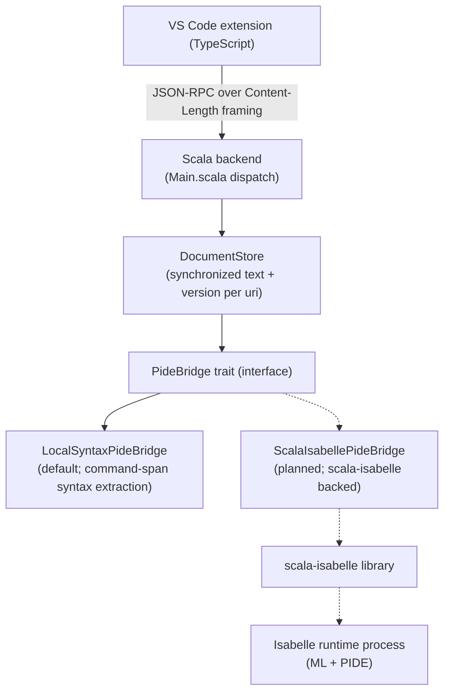

# PIDE integration plan

This document is a living plan for completing the Isabelle/PIDE-backed work in
milestones 4, 5, and 7 of the roadmap in [`README.md`](../README.md). It is the
forward-looking design note that sits behind the `PideBridge` seam introduced
by [PR #13](https://github.com/Arthur742Ramos/Isabelle-VSCode/pull/13)
(`backend/src/main/scala/dev/isabelle/vscode/server/PideBridge.scala`). The plan
explicitly separates what the Scala backend can do today from what real
Isabelle/PIDE integration will require, so future PRs can land that work in
small, reviewable increments. The existing request/response shapes for
`document/openTheory`, `document/update`, `proofState/get`, and
`sledgehammer/run` are designed to stay stable, but a real PIDE integration
will need new protocol surfaces too — notification-style messages for
streamed diagnostics and Sledgehammer progress, new result payloads for the
PIDE entity table, and at least one new status value (or a mapping into the
existing `CommandSpan.status` enum, which today is
`"pending" | "running" | "finished" | "failed" | "unknown"` and does not yet
distinguish `unprocessed` or `warned`). The bridge seam keeps the *shape* of
that work small and local; it does not pretend the extension never has to
change.

What exists today is foundations only. The backend ships a single
`LocalSyntaxPideBridge` implementation that produces conservative
command-span and "unavailable" responses from local syntax parsing; it does
**not** talk to a running Isabelle/PIDE process, does not produce live
per-command status updates, does not publish PIDE diagnostics, does not consume
PIDE entity metadata, does not compute live proof goals or context, and does
not run Sledgehammer proof search. A genuine PIDE integration must wire all of
those into the bridge — live document status (unprocessed / running / finished
/ failed / warned), PIDE diagnostics, the PIDE entity table, structured proof
state, and Sledgehammer proof search and minimization. This document tracks
what that work looks like and what has to land first.

## Architecture

The Scala backend was structured in
[PR #13](https://github.com/Arthur742Ramos/Isabelle-VSCode/pull/13) so that the
extension never has to branch on "PIDE vs. local-syntax" when reading the
existing document/proof/Sledgehammer responses. The extension speaks JSON-RPC;
the backend's `Main.scala` dispatcher routes document and proof-aware methods
through `DocumentStore`, which in turn invokes a `PideBridge`. Today, the only
implementation wired into `Main` is `LocalSyntaxPideBridge`. A planned
`ScalaIsabellePideBridge` (proposed follow-up scaffolding work; no PR or
commits on top of `main` yet — see "Configuration surface" below) will plug
into the same trait and produce structurally compatible JSON shapes from real
Isabelle/PIDE state, with new protocol additions layered on for surfaces the
bridge cannot deliver synchronously (diagnostics, progress, entity tables).

Solid arrows show what runs on `main` today. Dashed arrows mark planned work
that is not yet merged.

**VS Code extension (TypeScript).** The extension owns UI: commands, the
Explorer panels (Sessions, Proof Outline, Proof State, Sledgehammer, Theory
Graph, Theory Outline), decorations, hovers, and semantic tokens. It speaks the
typed JSON-RPC protocol declared in
[`src/protocol/messages.ts`](../src/protocol/messages.ts) and never imports
Isabelle/Scala code directly. Swapping bridges in the backend does not require
extension changes for the existing document/proof/Sledgehammer responses; new
PIDE-driven surfaces (diagnostics, entity metadata, semantic markup, streaming
progress) do require extension changes, tracked under "Capability roll-out
plan" below.

**Scala backend — `Main.scala` dispatch and `DocumentStore`.** The backend
reads framed JSON-RPC requests, validates the protocol version, and dispatches
methods. Document-aware methods (`document/openTheory`, `document/update`,
`document/close`, `proofState/get`, `sledgehammer/run`, `sledgehammer/cancel`)
all flow through `DocumentStore`, which keeps the latest synchronized text and
version per URI in memory. `DocumentStore` is the only place that talks to the
configured `PideBridge`; it guarantees the bridge only sees URIs that have been
synchronized first.

**`PideBridge` trait (the seam).** `PideBridge` declares three methods
(`documentResult`, `proofState`, `sledgehammer`) whose return shapes must
match the protocol declared in
[`src/protocol/messages.ts`](../src/protocol/messages.ts). The trait is the
extension-facing contract for those three response types; any new
implementation must produce structurally identical responses so the TypeScript
client does not need to branch on which bridge is wired in for the existing
calls. Surfaces the trait does not yet cover today (diagnostics, PIDE entity
metadata, semantic markup, streaming progress) will require additions to both
the trait and the JSON-RPC protocol — they are not free.

**`LocalSyntaxPideBridge` (default).** The implementation that ships today.
`documentResult` runs `CommandSpanParser` over the raw theory text and returns
command spans with a fixed `status: "pending"` and no PIDE-driven status.
`proofState` and `sledgehammer` always return `status: "unavailable"` with
explicit messages explaining that live PIDE integration is missing. This is
deliberately conservative: the user-visible UI never claims live proof checking
or Sledgehammer results that the backend cannot produce.

**`ScalaIsabellePideBridge` (planned; not yet on `main`).** The intended second
implementation, backed by the
[scala-isabelle](https://github.com/dominique-unruh/scala-isabelle) library and
a managed Isabelle runtime process. It is a planned follow-up scaffolding
piece — no commits exist on top of `main` for it yet, and no PR has been
opened. This document does not claim any behavior for it beyond what is listed
under "Capability roll-out plan"; the roll-out plan describes the increments
that will eventually turn it from a stub into a real PIDE-backed bridge over
multiple PRs.

## Runtime prerequisites

These constraints apply only to the planned `ScalaIsabellePideBridge` runtime,
not to compiling the project or running the local-syntax default.

- **Operating system.** Linux or macOS. scala-isabelle 0.4.5 does not support
  Windows for running an embedded Isabelle process; on Windows, only
  `LocalSyntaxPideBridge` (the default) will work end-to-end. The
  [scala-isabelle setup guide](https://dominique-unruh.github.io/scala-isabelle/setup.html)
  is the upstream source of truth for OS support.
- **Java.** Java 11 or newer at runtime, matching scala-isabelle's published
  minimum.
- **Isabelle.** Isabelle 2019 or newer installed locally, with the install path
  available as `ISABELLE_HOME`. The PIDE-backed bridge will spawn an Isabelle
  process and load ML/PIDE inside it; without a real Isabelle install, only
  `LocalSyntaxPideBridge` is functional.
- **Isabelle user directory (optional).** A user directory (typically passed
  via `ISABELLE_USER_HOME` or scala-isabelle's `userDir` option) lets the
  bridge use a project-local cache of ROOTS / heap images instead of the
  user's global Isabelle config.
- **Logic session (optional).** A session name such as `HOL` to load as the
  base logic on start; this affects what theories the PIDE-backed bridge can
  process without rebuilding.

Compile-time has **no** Isabelle dependency. scala-isabelle is published as a
Maven JAR (`de.unruh:scala-isabelle_2.13`), so adding it to the backend's sbt
build does not require Isabelle to be installed on CI. The existing
`ubuntu-latest` GitHub Actions workflow (`.github/workflows/ci.yml`), which
installs Node 20, Java 21, and sbt but not Isabelle, will keep working when the
scaffolding PRs add the dependency.

## Configuration surface

The runtime-level configuration that selects and parameterizes the bridge is
planned but **not yet on `main`**. It is the subject of a proposed
`pide/configure` plumbing scaffold (working branch name
`arthur742ramos/pide-config-plumbing`); at the time of writing that branch has
no commits on top of `main` and no PR has been opened. This section is a
forward contract so the doc, the scaffolding PR, and any future bridge PRs
stay aligned.

Planned VS Code settings (under the `isabelle.pide` namespace):

- `isabelle.pide.mode` — one of `"localSyntax"` (default) or `"scalaIsabelle"`.
  `localSyntax` keeps the current default behavior; `scalaIsabelle` opts in to
  the planned `ScalaIsabellePideBridge` when it ships.
- `isabelle.pide.isabelleHome` — path to the Isabelle installation. Required
  for `scalaIsabelle` mode; ignored otherwise.
- `isabelle.pide.userDir` — optional Isabelle user directory.
- `isabelle.pide.sessionName` — optional session name to associate with the
  embedded PIDE document model.
- `isabelle.pide.logicSession` — optional logic session to load as the base
  (for example `"HOL"`).

Planned VS Code command:

- `Isabelle: Configure PIDE Mode` — guides the user through picking
  `localSyntax` vs. `scalaIsabelle` and (if needed) filling in
  `isabelle.pide.isabelleHome` etc. Updates the workspace settings and emits a
  single `pide/configure` request to the backend.

Planned JSON-RPC method:

- `pide/configure` with params shaped like
  `{ "mode": "localSyntax" | "scalaIsabelle", "scalaIsabelle"?: { "isabelleHome": string, "userDir"?: string, "sessionName"?: string, "logicSession"?: string } }`.
  The backend will use this to swap the `PideBridge` implementation in
  `DocumentStore` at runtime, validate prerequisites (for example, that
  `isabelleHome` exists on a supported OS), and reject `scalaIsabelle` mode on
  Windows with a clear error rather than crashing during the first
  `document/openTheory`.

None of these settings, commands, or methods exist on `main` today. The
extension currently only exposes the settings listed in
[`package.json`](../package.json) (`isabelle.backend.*`, `isabelle.executablePath`,
`isabelle.session.*`, `isabelle.build.extraArgs`).

## Capability roll-out plan

These checklists are the concrete increments needed to turn
`ScalaIsabellePideBridge` from a stub into a real PIDE-backed bridge. Each
item names the `PideBridge` surface it changes and what kind of test would
prove it. scala-isabelle's public API is documented at the
[scala-isabelle javadoc](https://javadoc.io/doc/de.unruh/scala-isabelle_2.13/latest/de/unruh/isabelle/index.html);
specific class names below are starting points that the implementing PR must
verify against the live API.

- [ ] **Milestone 4 (PIDE document connection)**
  - [ ] **Per-command status plumbed through `PideBridge.documentResult`.**
    Replace the fixed `"status": "pending"` that `LocalSyntaxPideBridge`
    returns with the live PIDE status of each command. PIDE has more states
    than today's `CommandSpan.status` enum
    (`"pending" | "running" | "finished" | "failed" | "unknown"`), so this
    item includes deciding how to expose `unprocessed` and `warned` — either
    by extending the enum in
    [`src/protocol/messages.ts`](../src/protocol/messages.ts) (with a matching
    update to `extension.ts`'s decorations) or by mapping them onto existing
    values and surfacing the distinction in a separate field. The
    scala-isabelle bridge will likely register commands against an Isabelle
    theory loaded through its `pure.Theory` / `control.Isabelle` entry points
    and observe their processing state. Proof: a *gated integration test*
    (run only with a real Isabelle install present) that feeds a deliberately
    broken theory through the bridge and asserts at least one command returns
    a failed status, plus a unit-level test against a fake `PideBridge` that
    asserts the new enum/field is serialized as expected.
  - [ ] **PIDE diagnostics published as VS Code Diagnostics.** Today, the only
    diagnostics surface is the Isabelle CLI build runner, which parses
    `isabelle build` output. PIDE-backed diagnostics need a push channel
    because they arrive as PIDE processing completes, not synchronously with
    `document/openTheory`. This requires a new notification-style protocol
    message in [`src/protocol/messages.ts`](../src/protocol/messages.ts), a
    matching backend emission path next to `Main.scala`'s response writer, and
    a TypeScript consumer that publishes through
    `vscode.languages.createDiagnosticCollection`. Proof: a unit test against
    a fake bridge that emits the notification shape and asserts the consumer
    creates a diagnostic at the right range, plus a gated integration test
    (Isabelle required) that synchronizes a theory containing a known type
    error and asserts the diagnostic flows end to end.
  - [ ] **Document command IDs stable across edits.** Today,
    `CommandSpanParser` builds IDs as
    `"${document.uri}:${document.version}:${index}"`, so every edit invalidates
    every ID. The PIDE-backed bridge should reuse PIDE's own command IDs (or a
    stable hash of command text + position) so the extension can correlate
    decorations and diagnostics across edits without flicker. Proof: a unit
    test that opens a theory, edits a single command, and asserts that
    unchanged neighboring commands keep their IDs (this one can run as a
    pure unit test against the bridge implementation, no Isabelle required).

- [ ] **Milestone 5 (Semantic markup with entity metadata)**
  - [ ] **PIDE entity table → richer document symbols and hover.** Replace
    the local `CommandSpanParser`-derived hover and document-symbol content
    with entity data from PIDE's markup (theorem statements, definition
    bodies, locale parameters, …). The bridge alone is not enough: the trait
    only returns document spans, proof state, and Sledgehammer results today,
    so this also requires (a) a new `PideBridge` method or notification that
    exposes the entity table for a synchronized URI, (b) a new
    request/notification in [`src/protocol/messages.ts`](../src/protocol/messages.ts),
    and (c) updates to `src/semantic/IsabelleHoverProvider.ts` and
    `src/semantic/IsabelleDocumentSymbolProvider.ts` (plus the helpers in
    `src/semantic/documentSymbols.ts`) so they prefer PIDE entity data when
    available and fall back to local extraction otherwise. scala-isabelle
    will likely surface this through its `mlvalue.MLValue` / `pure.Theory`
    query helpers. Proof: a unit test against a fake bridge that asserts the
    hover provider renders the entity-table value when present and falls
    back to local syntax otherwise; plus a gated integration test that
    asserts a hover over a `lemma foo` shows the actual statement of `foo`.
  - [ ] **Cross-file go-to-definition for non-local declarations.** Today's
    `src/semantic/IsabelleDefinitionProvider.ts` resolves definitions using
    parsed `.thy` headers and locally extracted symbols only (see
    `src/semantic/definitions.ts`). The PIDE entity table makes it possible
    to jump to definitions in imported sessions (including AFP and the
    distribution libraries) by mapping entity names to their source file
    and offset. This requires the same new entity-table surface as the hover
    item above, plus a definition-provider change that consults the PIDE
    entity data before falling back to local resolution. Proof: a unit test
    against a fake bridge that returns a known entity → location mapping,
    plus a gated integration test that asserts go-to-definition on a `HOL`
    lemma like `nat_induct` resolves to the right file in the loaded
    session.
  - [ ] **PIDE markup-driven semantic tokens.** Replace the current
    keyword/symbol semantic tokenization in
    `src/semantic/IsabelleSemanticTokensProvider.ts` with the token classes
    PIDE emits as markup (free variables, bound variables, constants, type
    variables, inner-term syntax, …). This requires a new PIDE-markup
    payload on the existing `document/openTheory` / `document/update`
    response (or a sibling notification), an extension to the
    `SemanticTokensLegend` exposed by the provider, and a mapping in the
    bridge from PIDE markup tags to those token types. Proof: a unit test
    against a fake bridge that supplies a tagged token stream and asserts
    the provider's `SemanticTokensBuilder` output, plus a gated integration
    test asserting that a free variable inside a lemma is reported as a
    different semantic token type than a bound variable in the same goal.

- [ ] **Milestone 7 (Sledgehammer)**
  - [ ] **PIDE-driven Sledgehammer proof search dispatch and result
    streaming.** Replace the current `sledgehammer` stub (which always
    returns `"status": "unavailable"`) with a real call into Isabelle's
    `sledgehammer` command at the current command position. `sledgehammer/run`
    is a single JSON-RPC request/response today, and Sledgehammer can run for
    minutes, so the bridge will need *either* (a) to keep `sledgehammer/run`
    one-shot but return `"status": "running"` initially and emit progress and
    final results through a new notification channel (and have the existing
    `SledgehammerPanel.ts` consume that channel), *or* (b) extend
    `SledgehammerRunResult` with a sequence number / continuation token so
    the extension can poll. Either way it is a protocol addition, not a
    drop-in change to the existing response shape. Proof: a unit test
    against a fake bridge that exercises the streaming/notification or
    polling shape, plus a gated integration test using a trivial provable
    goal that asserts at least one suggestion is returned in
    `"status": "completed"`.
  - [ ] **Proof minimization.** After Sledgehammer returns a raw proof,
    expose Isabelle's minimization to shrink it (drop redundant facts, prefer
    `auto` / `simp` over `metis` when possible). The TypeScript surface
    (`SledgehammerSuggestion`) already has room for a `proofText`, so the
    minimized form can ride inside the existing field without protocol
    changes. Proof: a unit test against a fake bridge that returns a known
    raw+minimized pair and asserts the panel prefers the minimized form;
    plus a gated integration test that asserts a minimized proof is shorter
    than the raw Sledgehammer output for a known over-specified goal.
  - [ ] **Auto-insert of vetted suggestions.** The existing
    `Isabelle: Insert Sledgehammer Proof` command inserts whatever
    `SledgehammerSuggestion.proofText` contains, which the current bridge
    never populates. Once real suggestions are flowing, this becomes the
    user-visible end of the loop: the extension already guards insertion
    behind explicit user action, so the bridge-side work is to make sure the
    proof text it returns is byte-for-byte the proof Isabelle accepts. Proof:
    a gated end-to-end test (Isabelle required) that runs Sledgehammer,
    inserts the top suggestion, runs `isabelle build`, and asserts the build
    succeeds.

## Honest limits

- **Opt-in.** The default behavior of the extension and backend will remain
  the conservative local-syntax path. `LocalSyntaxPideBridge` is the only
  implementation wired into `Main.scala` today, and even after
  `ScalaIsabellePideBridge` lands the planned `isabelle.pide.mode` setting
  will default to `"localSyntax"`. Users have to choose to opt in to the
  PIDE-backed path.
- **Windows.** scala-isabelle 0.4.5 does not support running an embedded
  Isabelle process on Windows. Windows users can still compile the project
  and use `LocalSyntaxPideBridge`; they cannot run `scalaIsabelle` mode
  locally. The planned `pide/configure` validator will reject this case with
  a clear error.
- **scala-isabelle is not a PIDE protocol library.** scala-isabelle exposes
  the Isabelle ML runtime and the `pure.Theory` / `control.Isabelle` /
  `mlvalue.MLValue` layer; it does not directly hand out PIDE
  `Document.Snapshot` values the way Isabelle/jEdit does. A large portion of
  the work below the bridge will be writing ML helpers (loaded into the
  embedded Isabelle process via scala-isabelle) that expose command status,
  markup, entity tables, and proof goals as JSON-friendly values the Scala
  side can deserialize.
- **Real PIDE integration is multi-week engineering.** Each checkbox above is
  a small PR; the whole list is not. This document is the roadmap, not a
  promise of delivery in any particular release.

## References

- scala-isabelle project: <https://github.com/dominique-unruh/scala-isabelle>
- scala-isabelle setup guide: <https://dominique-unruh.github.io/scala-isabelle/setup.html>
- scala-isabelle javadoc: <https://javadoc.io/doc/de.unruh/scala-isabelle_2.13/latest/de/unruh/isabelle/index.html>
- Isabelle/jEdit PIDE protocol reference: `src/Pure/PIDE/` inside an Isabelle
  distribution (no canonical online mirror; consult a local install).
- This repo's `PideBridge` trait and default implementation:
  [`backend/src/main/scala/dev/isabelle/vscode/server/PideBridge.scala`](../backend/src/main/scala/dev/isabelle/vscode/server/PideBridge.scala)
- This repo's JSON-RPC protocol surface:
  [`src/protocol/messages.ts`](../src/protocol/messages.ts)
- This repo's backend dispatch:
  [`backend/src/main/scala/dev/isabelle/vscode/server/Main.scala`](../backend/src/main/scala/dev/isabelle/vscode/server/Main.scala)
