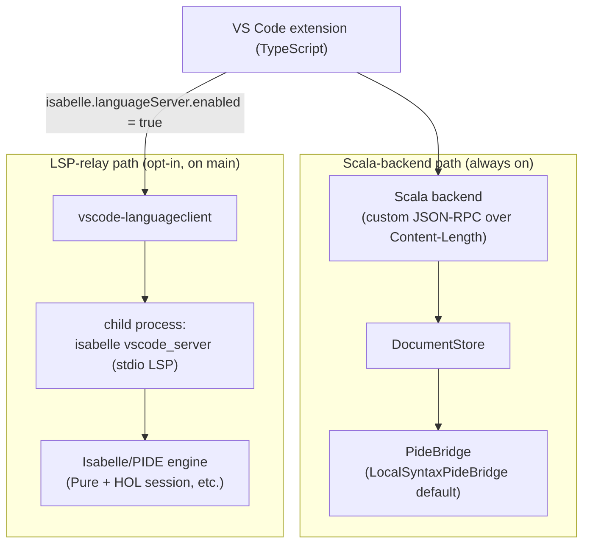

# PIDE integration plan

This document is a living plan for completing milestones 4 (PIDE document
connection), 5 (semantic markup with entity metadata), and 7 (Sledgehammer)
of the [repository roadmap](../README.md#roadmap) by relaying Isabelle's own
bundled language server — `isabelle vscode_server`, shipped inside the
Isabelle distribution under `src/Tools/VSCode/server` — through the standard
Language Server Protocol from this VS Code extension. It records the chosen
architecture, the runtime prerequisites, the configuration surface the
extension intends to expose, the capability roll-out plan, and the honest
limits of the approach. It is meant to be readable in roughly ten minutes by
someone who already understands the existing extension and Scala backend.

Today the extension is intentionally a set of conservative local foundations
(local syntax highlighting, command-span extraction, document-status
surface, theory outline, theory graph, sledgehammer workflow boundary,
checked repair preview) sitting on top of a Scala backend with a
[`PideBridge`](../backend/src/main/scala/dev/isabelle/vscode/server/PideBridge.scala)
seam whose default implementation is the local-syntax fallback. Real PIDE
behaviour — live document processing, Isabelle-published diagnostics,
entity-level hovers and definitions, structured proof state, Sledgehammer
proof search — comes from running Isabelle's own `isabelle vscode_server`
as a child LSP process of the extension. The TypeScript scaffolding for
that client landed in PR #26 with cross-platform support (Linux, macOS,
and Windows via the `.ps1` auto-wrap added in PR #27); enabling it on a
machine with Isabelle 2019+ installed turns on PIDE-flavoured diagnostics,
hover, definition, completion, and document-symbol features. The
capability roll-out plan below tracks the per-feature wiring that layers
extension-specific surfaces (the theory-outline merge, status-bar
decoration source switching, Sledgehammer panel routing) on top of what
the server already provides.

## Architecture

The chosen architecture keeps today's Scala backend exactly where it is, and
adds the Isabelle-bundled language server as an additive, opt-in second
path. As of PR #26 and PR #27 the architecture below describes the shipped
state on `main`:



> Both paths now ship on `main`. The Scala-backend path is always active; the
> LSP-relay path activates when the user sets
> `isabelle.languageServer.enabled = true`. The two paths coexist — VS Code
> aggregates results from both the LSP-provided features and the existing
> local providers.

The Scala backend remains the home of session discovery, ROOT/ROOTS
parsing, the Isabelle CLI build runner, the document-synchronization
protocol, command-span extraction, document-status summaries, the proof-state
boundary, the Sledgehammer workflow boundary, and any future bridge-driven
semantics. The `PideBridge` seam introduced in PR #13
([`backend/src/main/scala/dev/isabelle/vscode/server/PideBridge.scala`](../backend/src/main/scala/dev/isabelle/vscode/server/PideBridge.scala))
is preserved as the integration point for future Scala-side PIDE work that
does not naturally fit into LSP requests.

The LSP relay is an additive, opt-in path. When enabled (PR #26), the
extension spawns `isabelle vscode_server` as a child process and routes
LSP-standard features (diagnostics, hover, definition, completion, document
symbols) through VS Code's standard surfaces using
[`vscode-languageclient`](https://www.npmjs.com/package/vscode-languageclient).
Because LSP is the transport, those features land on the same VS Code UI
that any other language server uses (the Problems panel, the hover popover,
F12 navigation, the outline view, the completion list).

Why this approach:

- **Cross-platform by default.** `isabelle vscode_server` is part of the
  official Isabelle distribution, so it works anywhere the `isabelle`
  command runs — Linux, macOS, and Windows. The Windows `.ps1` launcher is
  auto-wrapped via `powershell.exe -File` so users don't need any extra
  configuration (PR #27).
- **Leverages official Isabelle infrastructure.** The PIDE wiring inside
  `isabelle vscode_server` is maintained by the Isabelle developers
  themselves and tracks the real PIDE engine. Reusing it avoids
  reimplementing PIDE inside the Scala backend.
- **Additive, not destructive.** The existing local foundations (theory
  outline, command-span decorations, conservative document-status surface,
  checked repair previews) keep working unchanged for users who do not
  enable the LSP relay, and continue to work alongside it for users who do.
- **No protocol churn.** The custom Content-Length JSON-RPC protocol between
  the extension and the Scala backend does not change; the new path is a
  separate LSP connection.

## Runtime prerequisites

The LSP relay requires the following runtime environment when
`isabelle.languageServer.enabled = true`. The relay itself ships on `main`
(PR #26 and PR #27); these requirements describe what users need installed
on their machine to actually exercise it.

- A working Isabelle installation reachable through the existing
  `isabelle.executablePath` setting (default: `isabelle` on `PATH`). The
  `isabelle vscode_server` tool must be present in that installation. It
  has shipped as part of the official Isabelle distribution for several
  recent major releases. The LSP client scaffold landed in PR #26 was
  verified end-to-end against **Isabelle 2025-2**, where the server
  advertises `codeActionProvider`, `completionProvider`,
  `definitionProvider`, `documentHighlightProvider`, `hoverProvider`, and
  `textDocumentSync` capabilities.
- No additional Linux- or macOS-only restriction. Isabelle's official
  Windows distribution ships its launcher as `isabelle.ps1`; the LSP
  client auto-wraps `.ps1`/`.psm1` paths via
  `powershell.exe -NoLogo -NoProfile -ExecutionPolicy Bypass -File <path>`
  (added in PR #27), so Windows users can enable the LSP path with the
  default `isabelle.executablePath` without any extra configuration.
- Java is already required by Isabelle itself; the extension does not add a
  separate Java dependency from the LSP-client side.
- The extension's own runtime requirement (Node.js for the extension host,
  VS Code `^1.90.0` as declared in
  [`package.json`](../package.json#L26-L28)) is unchanged.

## Configuration surface

The settings, commands, and UI surface below are **shipped on `main`** as
of PR #26 (LSP client scaffold) and PR #27 (Windows `.ps1` auto-wrap).
Toggling `isabelle.languageServer.enabled = true` actually starts a child
`isabelle vscode_server` process today; the capability roll-out plan below
describes the per-feature work that layers VS Code surfaces on top of what
the server already provides.

Shipped settings (under the existing `Isabelle PIDE` configuration block):

- `isabelle.languageServer.enabled` — boolean, default `false`. Master
  switch. The default-off behaviour means installing or upgrading the
  extension does not change behaviour for existing users until they
  explicitly opt in.
- `isabelle.languageServer.extraArgs` — array of strings, default `[]`.
  Extra command-line arguments appended to the `isabelle vscode_server`
  invocation, for users who need to pass Isabelle-specific flags (for
  example session selection or logging options) that the extension does not
  surface directly.
- `isabelle.languageServer.logVerbose` — boolean, default `false`. When
  true, the extension is intended to log the LSP traffic it relays to and
  from `isabelle vscode_server` in its existing `Isabelle PIDE` output
  channel, for diagnosing connection issues.

Shipped commands (registered alongside the existing `Isabelle:` command
family):

- `Isabelle: Start Language Server` — starts the `isabelle vscode_server`
  child process and connects the LSP client.
- `Isabelle: Stop Language Server` — stops the LSP client and the child
  process.
- `Isabelle: Restart Language Server` — convenience for stop-then-start,
  useful after editing settings or recovering from an unhealthy state.
- `Isabelle: Show Language Server Status` — opens a human-readable summary
  of the current LSP connection state, the Isabelle executable in use, and
  any recent connection errors.

Shipped UI:

- A status-bar item that reflects the current LSP connection state
  (disabled, starting, running, errored, stopped) and offers click-through
  to the status command above.

## Capability roll-out plan

Each checkbox below is concrete: it names the LSP request or notification
involved, the file or module that will own the integration, and the
validation that will demonstrate the capability works end-to-end. None of
these items are done today.

```
- [ ] Milestone 4 (PIDE document connection)
  - [ ] Forward textDocument/didOpen, textDocument/didChange, and
        textDocument/didClose for `.thy` documents from the extension to
        isabelle vscode_server, alongside the existing custom
        document/openTheory|update|close traffic to the Scala backend. Owned
        by `src/lsp/IsabelleLanguageClient.ts`. Validated by opening,
        editing, and closing a theory while the LSP is enabled and observing
        the round-trip in the LSP trace.
  - [ ] Surface PublishDiagnostics notifications from isabelle vscode_server
        through VS Code's Diagnostics collection, alongside (not replacing)
        the existing CLI-build diagnostics produced by
        `src/build/diagnostics.ts`. By design the two sources are owned by
        distinct `vscode.DiagnosticCollection` instances:
        `BuildService` owns the collection named
        `"isabelle-build"` (constant `BUILD_DIAGNOSTIC_COLLECTION_NAME`) and
        tags each diagnostic with `source = "isabelle build"` (constant
        `BUILD_DIAGNOSTIC_SOURCE`); the Isabelle LSP client uses a separate
        collection assigned by VS Code via `vscode-languageclient`, so the
        two never overwrite one another for the same file. The structural
        coexistence — distinct collection names plus the no-collision
        guard rails — is pinned by `test/lsp/diagnosticsCoexistence.test.ts`.
        End-to-end verification (introducing a deliberate Isabelle error in
        a synchronized theory and observing both the LSP diagnostic and the
        CLI-build diagnostic in the Problems panel) still requires a live
        VS Code session against an Isabelle install and remains a Tier-2
        manual-testing follow-up; this checkbox stays unchecked until that
        live verification is recorded.
  - [x] Reflect server-driven document status in the existing
        `CommandSpanDecorationsService` gutter so that, when the LSP is
        active, the "local-only pending" status is replaced by an
        Isabelle-published status. The local fallback in
        `src/document/CommandSpanDecorations.ts` and the
        `DocumentStatusService` summary must keep working when the LSP is
        off. Shipped with a conservative binary policy:
        `shouldSuppressLocalCommandSpanDecorations(state)` returns true
        only when the LSP is `running`, in which case the local
        dashed-border placeholder is hidden in favor of the LSP's own
        published diagnostics. When the LSP is `disabled`, `starting`,
        `stopping`, `failed`, or not wired at all, the existing local
        decorations render unchanged. Once `isabelle vscode_server`
        exposes a per-command status surface (it does not today — see
        [`sledgehammer_lsp_research.md`](sledgehammer_lsp_research.md)
        for the analogous Sledgehammer investigation), the policy will
        extend to swap the source rather than suppress. Validated by
        unit tests on the pure policy helper; end-to-end toggling of
        `isabelle.languageServer.enabled` and observing the decoration
        source change remains a Tier-2 manual verification.

- [ ] Milestone 5 (Semantic markup with entity metadata)
  - [ ] Route textDocument/hover through LSP for PIDE-driven entity
        descriptions. The existing local hover provider in
        `src/semantic/IsabelleHoverProvider.ts` remains registered and acts
        as a fallback when the LSP is off or returns no hover. Validated by
        hovering an imported constant defined in another theory and
        observing an Isabelle-sourced hover.
  - [ ] Route textDocument/definition through LSP for cross-file go-to-
        definition of non-local declarations. The existing local definition
        provider in `src/semantic/IsabelleDefinitionProvider.ts` keeps
        handling in-file declarations as a fallback. Validated by F12 on a
        symbol declared in a theory imported by the active file.
  - [ ] Route textDocument/documentSymbol through LSP and merge the result
        with the existing local theory outline in
        `src/semantic/TheoryOutlineTreeProvider.ts`. The merge policy
        (LSP-wins versus union) must be decided as part of this work.
        Validated by comparing the outline of a non-trivial theory with the
        LSP on and off.
  - [ ] Route textDocument/completion through LSP and wire its CompletionItem
        results into VS Code's completion UI. Validated by typing a partial
        identifier and observing PIDE-sourced completion candidates.

- [ ] Milestone 7 (Sledgehammer)
  - [x] Research: determine whether `isabelle vscode_server` exposes
        Sledgehammer suggestions as LSP custom requests, as a code-action
        contribution, or only through its own built-in command palette.
        Captured in [`sledgehammer_lsp_research.md`](sledgehammer_lsp_research.md):
        the surface is a set of `PIDE/sledgehammer_*` and `PIDE/caret_update`
        LSP notifications (not requests, not code actions, not workspace
        commands, not advertised in `initialize` capabilities); see that
        document for the full message shapes and the implications for
        `src/sledgehammer/SledgehammerPanel.ts`.
  - [x] Implement: once the upstream Sledgehammer surface is confirmed,
        bridge `src/sledgehammer/SledgehammerPanel.ts` to the correct LSP
        request and replace the current "unavailable" placeholder from
        `LocalSyntaxPideBridge.sledgehammer` for users who have the LSP
        enabled. Users without the LSP keep the existing typed boundary.
        Shipped in two layers: `src/sledgehammer/LspSledgehammerSession.ts`
        encapsulates the upstream `PIDE/caret_update` ->
        `PIDE/sledgehammer_request` -> `PIDE/sledgehammer_status` /
        `PIDE/sledgehammer_output` -> `PIDE/sledgehammer_cancel` dance
        as a one-shot, vscode-free orchestrator; the panel itself
        branches on `IsabelleLanguageClient.getStatus().state ===
        "running"` and uses the orchestrator in LSP mode while keeping
        the existing `sledgehammer/run` Scala-backend path otherwise.
        Parsed `PIDE/sledgehammer_output` segments render in a new
        "Prover output" section via the renderer extension landed
        alongside the PIDE XML parser. Sendbacks surface as
        `SledgehammerSuggestion` entries so the existing
        `Isabelle: Insert Sledgehammer Proof` command keeps working.
        Mid-run LSP failure (the client leaves the `running` state)
        aborts the active session, records a failure, and surfaces a
        retry-friendly warning. End-to-end verification against a
        live Isabelle install remains a Tier-2 manual follow-up; the
        unit-level orchestrator + conversion helpers are fully
        covered.
  - [x] Implement the two-step sendback insert flow (research
        recommendation #5) — when the user clicks an inserted
        suggestion, send `PIDE/sledgehammer_sendback` and apply the
        server's `PIDE/sledgehammer_insert` reply as a
        version-validated workspace edit. Shipped as
        `src/sledgehammer/pideSledgehammerInsert.ts` (pure
        `validatePideInsertPayload` + async `requestPideInsert` that
        subscribes before sending, drops malformed/mismatched
        replies, times out on missing replies, and returns a typed
        success-or-reason result) plus a panel-side branch in
        `SledgehammerPanel.insertFirstSuggestion()` that picks
        LSP-mode when the language client is `running` and applies
        the server-supplied position via `WorkspaceEdit`. The
        existing document-version guard is preserved to reject
        stale inserts after the theory has been edited since the
        Sledgehammer run.
  - [ ] Implement a quiescence gate before dispatching
        `PIDE/sledgehammer_request` (research recommendation #7) so the
        first run after `didOpen` does not reproducibly receive
        `<error_message>Unknown proof context</error_message>` for
        non-quiescent prover state.
  - [ ] Implement proof-minimization wiring (the second half of milestone
        7), driven by the same upstream Sledgehammer surface.
```

## Honest limits

- The LSP relay is opt-in. Default extension behaviour does not change.
  Users who never set `isabelle.languageServer.enabled` to `true` keep
  exactly the conservative-local-foundations experience the extension ships
  today.
- The Scala backend and the `PideBridge` seam remain the extension's
  repository-specific semantic boundary for session discovery,
  command-span extraction, the custom JSON-RPC contract used by
  `DocumentSyncService`, the document-status surface, the proof-state
  boundary, the Sledgehammer workflow boundary, and any future
  non-LSP-shaped PIDE work. The LSP client provides editor-facing PIDE
  services where `isabelle vscode_server` exposes them, but it does not
  replace the backend protocol and it does not remove or subsume the
  `PideBridge` seam.
- Some `isabelle vscode_server` features rely on Isabelle-specific LSP
  extensions whose exact request shapes can change between Isabelle major
  releases. The extension pins its compatibility to specific Isabelle major
  versions; incompatibilities surface through the language-server
  status-bar item rather than failing silently.
- The extension does not vendor Isabelle. Users must install Isabelle
  themselves and either keep `isabelle` on `PATH` or set
  `isabelle.executablePath`. The same is true today for the existing CLI
  build runner.
- The LSP client scaffold (PR #26) and the Windows `.ps1` auto-wrap
  (PR #27) are on `main`. The capability roll-out checklist above lists
  the per-feature integration work that still needs to land — the LSP
  connection itself is wired and verified end-to-end.

## References

- Isabelle distribution VS Code source (upstream `isabelle vscode_server`
  implementation):
  <https://isabelle.in.tum.de/repos/isabelle/file/Isabelle2024/src/Tools/VSCode>
- Microsoft Language Server Protocol specification:
  <https://microsoft.github.io/language-server-protocol>
- `vscode-languageclient` npm package (the LSP client dependency):
  <https://www.npmjs.com/package/vscode-languageclient>
- Microsoft Language Server Extension Guide:
  <https://code.visualstudio.com/api/language-extensions/language-server-extension-guide>
- This repository's PIDE bridge seam:
  [`backend/src/main/scala/dev/isabelle/vscode/server/PideBridge.scala`](../backend/src/main/scala/dev/isabelle/vscode/server/PideBridge.scala)
- LSP client lifecycle owner:
  [`src/lsp/IsabelleLanguageClient.ts`](../src/lsp/IsabelleLanguageClient.ts) (introduced in PR #26)
- Windows `.ps1` auto-wrap helper:
  [`src/lsp/languageServerArgs.ts`](../src/lsp/languageServerArgs.ts) (introduced in PR #27)
